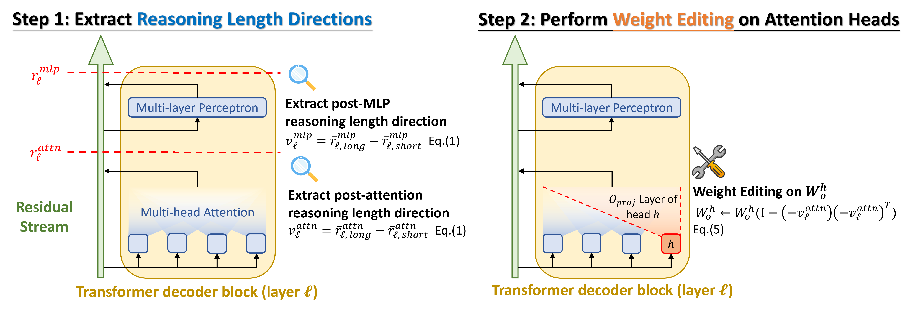

# ThinkEdit

This is the official repository for the paper: [**ThinkEdit: Interpretable Weight Editing to Mitigate Overly Short Thinking in Reasoning Models**](https://arxiv.org/abs/2503.22048)[[project website](https://lilywenglab.github.io/ThinkEdit/)].
### Faster workflow with my modifications
**Generate model output**
`python3 gen_response_fast.py --vllm --model xyz --dataset abc`
**Extract steering vector**
`python3 extract_tl.py --model abc --control [attn, mlp]`
**Run Steering Experiments**
`python3 steering_eval.py --model abc --control [attn, mlp] --dataset xyz --direction_weight jkl`

## Overview

<p align="center">
  
</p>

## Set Up

```bash
pip install -r requirements.txt
```

If you want to skip all the steps and directly access the resulting output files, you can download them through:

```bash
gdown https://drive.google.com/uc?id=1WGJOV_Uh1UulU-sNwA7Gy82NddvljDlP
```
and then unzip the file
```bash
unzip ThinkEdit.zip
```

## Steer along Reasoning Length Direction

### Step 1: Generate responses for probing from GSM8k

First, collect the responses from the reasoning models and store them in `responses/` for extracting hidden states later:

```bash
python generate response_gsm8k.py
```

Specify the `--model` argument: `deepseek-qwen-1.5b`, `deepseek-llama3-8b`, `deepseek-qwen-14b`

### Step 2: Extract the Reasoning Length Direction

Next, extract the layerwise directions from Self-Attn or MLP and store them in `directions/`:

```bash
python extract_thinking_length_directiongsm8k_attn.py
python extract_thinking_length_directiongsm8k_mlp.py
```

Specify the `--model` argument: `deepseek-qwen-1.5b`, `deepseek-llama3-8b`, `deepseek-qwen-14b`.

### Step 3: Steer the reasoning length of the models

Finally, steer the models with the directions and observe changes in accuracy and reasoning length. To evaluate on 200 test examples from gsm8k and store the results in `gsm8k_all_layer_thinking_length_steering_results/`:

```bash
python thinking_length_steering_gsm8k.py
```

Specify the `--model` argument: `deepseek-qwen-1.5b`, `deepseek-llama3-8b`, `deepseek-qwen-14b`.

`--control` argument options: `thinking_length_attn`, `thinking_length_mlp`.

The steering strength alpha (`--direction_weight`): we use `-0.08 -0.07 ... 0.07 0.08` in our paper.

Similarly, to evaluate 140 Level-5 examples from MATH and store the results in `math_level5_all_layer_thinking_length_steering_results/`:

```bash
python thinking_length_steering_math_level6.py
```

Specify arguments accordingly.

To steer only one layer each time and store the results in `gsm8k_layerwise_thinking_length_steering_results/`:

```bash
python thinking_length_layerwise_steering_gsm8k.py
```

Specify arguments accordingly. Use `--layer` to specify the layer and set `--direction_weight` to `-1` or `1` (as in our paper). Running the layerwise analysis can take considerable time. We suggest using `automate_layerwise_steering_jobs.sh` to handle the jobs; please modify the script based on your hardware.

## ThinkEdit models: Weight editing short reasoning heads

### Step 1: Find the short reasoning heads

First, identify the short reasoning heads by calculating their per-head contribution to the short reasoning direction:

```bash
python find_short_thinking_attn_heads.py
```

Specify the `--model` argument: `deepseek-qwen-1.5b`, `deepseek-llama3-8b`, `deepseek-qwen-14b`.

This will output a list of short reasoning heads and a heatmap figure of every head's contribution.

### Step 2: Perform Weight Editing

Next, perform weight editing to the `o_proj` layer of the short reasoning heads and store the model under `ThinkEdit_models/`:

```bash
python get_ThinkEdit_models.py
```

Specify the `--model` argument: `deepseek-qwen-1.5b`, `deepseek-llama3-8b`, `deepseek-qwen-14b`.

We have provided ThinkEdit models on the Huggingface repo:
- `cesun/ThinkEdit-deepseek-qwen-14b`
- `cesun/ThinkEdit-deepseek-llama3-8b`
- `cesun/ThinkEdit-deepseek-qwen-1.5b`

You can skip this step and our evaluation script will directly download the models from Huggingface.

### Step 3: Evaluate the performance of the ThinkEdit models

Finally, evaluate the performance of the original and ThinkEdit models and store the results under `ThinkEdit_model_evaluation_results/`. We use vllm to speed up evaluation:

```bash
CUDA_VISIBLE_DEVICES={your available gpus} python evaluate_ThinkEdit_models.py
```

Specify the `--model` argument: `deepseek-qwen-1.5b`, `deepseek-llama3-8b`, `deepseek-qwen-14b`, `ThinkEdit-deepseek-qwen-14b`, `ThinkEdit-deepseek-llama3-8b`, `ThinkEdit-deepseek-qwen-1.5b`.

`--dataset` argument: `gsm8k`, `mmlu_elementary_math`, `MATH-500`, `MATH-level1`, `MATH-level5`.

`--n_samples` argument: we set this to 10 in our paper, meaning each question is evaluated 10 times.

`--tensor_parallel_size` argument: set this according to your number of GPUs; it should be a factor of the number of attention heads in each model. We recommend setting it to 4.

After you have all the results, run:

```bash
python analyze_ThinkEdit_performance.py
```

to generate the plots and tables shown in our paper.

## Cite this work

Chung-En Sun, Ge Yan, Tsui-Wei Weng, "ThinkEdit: Interpretable Weight Editing to Mitigate Overly Short Thinking in Reasoning Models", arxiv preprint

```bibtex
@article{ThinkEdit,
   title={ThinkEdit: Interpretable Weight Editing to Mitigate Overly Short Thinking in Reasoning Models},
   author={Chung-En Sun, Ge Yan, Tsui-Wei Weng},
   journal={arXiv},
   year={2025}
}
```

